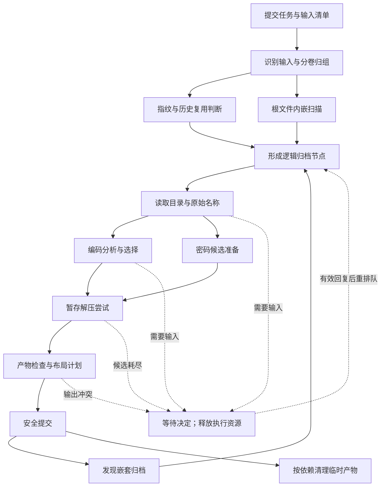

# SmartZip 任务系统设计

状态：2026-09-19 首版已接入解压执行链。节点阶段、共享协调器、非阻塞决定、持久队列、任务级预算、暂停恢复、owner lock、并发重启恢复与提交对账已落地；扫描续点、进程级临时空间预约、预览配额和真实负载自适应仍按本文边界继续演进。范围以 [requirements.md 第 0 节](requirements.md#0-当前产品范围2026-09-19) 为准：智能解压、浏览预览、任务调度与恢复；不包含压缩创建。本文是任务系统的设计依据，覆盖旧方案中相冲突的调度、密码并行和恢复描述。

## 1. 目标与设计选择

采用 **一个协调器管理动态任务依赖，按阶段申请资源、按任务公平分配执行机会** 的结构。

调度单位不是整个批次或整个文件，而是某个归档节点的一次可执行阶段。同一任务里的多个文件、不同任务里的独立节点可以交错执行；一个节点等待密码、编码选择、内嵌选择或输出冲突处理，不阻塞其他节点。

优化目标按以下顺序约束：

1. 保持输入、输出提交与恢复的正确性，不突破用户设置的安全预算。
2. 保证预览和交互回复有合理响应，优先级调整能影响后续派发，低优先级任务不会永久饿死。
3. 在上述约束内缩短批次总完成时间、减少重复扫描/读取/解压和临时数据搬运。
4. 利用可用 CPU、内存、磁盘和后端能力；利用率是解释性能的指标，不以所有核心一直满载为目标。

不预先生成完整任务图；内嵌识别和已提交产物的扫描可以不断增加节点。沿用现有 workspace，在 `smartzip-engine` 内增加协调、阶段、资源和恢复模块，不先创建通用工作流框架或新的 scheduler crate。

### 当前实现与保留边界

| 当前实现 | 对新系统的影响 |
|---|---|
| GUI 解压批次共用进程内协调器；界面队列仍负责展示和提交前编辑 | 资源准入、等待和公平选择由协调器决定，界面顺序作为持久队列位置提交 |
| `engine/extract_workflow.rs` 在单节点内仍用 `VecDeque` 管理动态发现候选 | 根节点可并行，阶段变化持久化；单节点的密码尝试和动态孩子仍保持顺序以避免多个写 staging 的尝试 |
| `PreparedArchive` 持有切片/分卷临时文件 RAII guard | 把临时产物所有权交给任务级产物管理，不能在等待或让出阶段时被析构删除 |
| `OutputMaterializer` 已拆成暂存、计划、提交和清理 | 提交意图、对象身份、标记、目标、备份路径、用量与成功事实先持久化；崩溃后只在证据唯一时补记或回滚 |
| 执行状态由 `StateStore` 专用线程持有 SQLite 连接 | 密码和 known-file 服务仍按原职责访问各自 repository，不再另写第二份任务完成历史 |
| 调度器已统一 CPU、后端进程、设备 I/O 与提交路径租约；任务级实际输出和嵌套候选用量持久化 | `budget.rs` 在写入期间继续监测实际输出和空闲空间；进程级临时空间预约和内存估算尚未接入 |
| 恢复入口并发驱动未暂停任务并保留暂停位 | 一个恢复任务等待输入不会阻塞其他恢复任务或当前请求；继续任务后重新参与公平调度 |
| scanner 已支持有界读取与取消，但没有可序列化扫描续点 | 首版以扫描阶段为恢复边界；安全让出和扫描续点逐步扩展，不能宣称已经支持 |

以上判断来自当前工作区源码，不是旧设计中的目标能力。

## 2. 用户任务、文件与执行单元

| 对象 | 职责与身份 |
|---|---|
| `Task` | 一次用户提交：操作、输入集合、优先级、排队位置、配置快照。可含多个根文件，复用现有 `TaskId` |
| `ArchiveNode` | 一个逻辑归档：单文件、一个完整分卷组、一个内嵌片段或一个嵌套归档；有稳定 `NodeId` 和父节点 |
| `StageRun` | 某节点的一个阶段执行，例如扫描或解压；携带 `stage`、`generation`、`attempt_id`，是实际调度单位 |
| `Artifact` | 原始输入引用、归一化分卷、切片、暂存树、已提交输出、目录元数据等有生命周期的产物 |
| `Decision` | 密码、编码、内嵌选择、覆盖等等待；用 `DecisionId + node_generation` 校验回复，不依赖仍活着的 future |
| `ResourceLease` | 一次阶段实际获准的 CPU、内存估计、I/O 名额、进程额度及短期路径访问权 |

分卷成员是一个节点的多个输入，不按每个 `.001/.002` 派发解压。候选阶段按输入身份、卷成员集合、片段范围合并重复引用；入口不确定时保留缺卷/歧义诊断，不并行猜测多个破坏性执行路径。

`NodeId` 与源路径、名称编码、排队位置无关。新任务 ID 改用跨进程随机唯一标识，保留旧 ID 的可读取性；现有“毫秒 + 进程内序号”不能承担多进程恢复身份。

嵌套节点只是依赖父节点的已提交产物，兄弟节点不互相依赖。某父节点的“自身解压成功”与“整个子树完成”分开呈现；不能因为一个孩子等待密码，把父节点已经成功提交的历史改成失败或未解压。

## 3. 阶段依赖与执行粒度



图中的等待返回表示恢复相应阶段，不表示从头重复所有工作。阶段图有条件分支：

- 未加密目录可先读原始名称，编码计算与密码候选准备可并行；加密目录须先取得可读目录的凭据，再做名称分析。
- 目录访问成功不证明内容密码有效；解压成功才用于内容密码成功统计。`test` 是独立用户操作，不插成每次解压前的完整测试。
- 已有明确编码、可信缓存事实或历史跳过结果时剪掉不需要的后续阶段；缓存必须匹配输入版本和分析选项。
- 预览复用输入解析、目录与编码事实，接到 `ReadMember -> DecodePreview` 分支；维持成员大小、耗时与取消限制，不默认完整解压。
- 非归档文件只保留必要的发现结果，不为每个普通成员建立完整归档节点或常驻 future。

### 阶段契约

| 阶段 | 输入与输出 | 主要资源 | 调度与让出边界 |
|---|---|---|---|
| `ResolveInputs` | 输入页、目录快照 → 单文件/分卷集合/待确认项 | 元数据 I/O、少量 CPU | 按目录页/输入页让出；分卷组锁定身份后再派发 |
| `Fingerprint` | 文件或片段 → 当前身份、历史命中事实 | 少量随机读 | 小阶段；全局去重判断不再写另一套状态 |
| `ScanEmbedded` | 输入范围、策略 → 找到的片段及覆盖进度 | 顺序读；某些格式还需解码 CPU/内存 | 按安全扫描块让出；解析器不能续接时保留租约直到可返回边界 |
| `ReadMetadata` | 归档引用、可选凭据 → 目录、原始名字节、加密事实 | 随机读、可选子进程 | 有界目录分页/捕获；解析结果按输入版本复用 |
| `AnalyzeEncoding` | 原始名字节 → 候选、置信度、名称预览 | CPU、元数据内存 | 默认无磁盘访问；不为每个候选重新启动全量 listing |
| `PrepareAccess` | 输入引用 → 后端可读路径、切片/分卷产物 | 读写带宽、临时空间 | 尽量靠近消费者执行；可直接读范围就不预先复制 |
| `ExtractAttempt` | 后端、编码、单个密码候选 → 暂存输出/分类错误 | CPU、源/目标 I/O、进程、空间 | 一次外部后端调用为不可抢占区；失败清理完成后才换候选 |
| `InspectAndPlan` | 完整暂存树 → 路径/预算检查、布局与冲突计划 | 元数据 I/O、少量 CPU | 可按页检查；不是重新完整 `test` |
| `Commit` | 暂存树、有效目标计划 → 提交事实与输出句柄 | 目标路径独占；rename 或有限写入 | 很短的受保护阶段；取消/暂停需等提交或回滚完成 |
| `DiscoverChildren` | 稳定已提交输出 → 新节点页与依赖 | 元数据 I/O、选择性的内容扫描 | 分页增量发布；不等待所有根文件解压完 |
| `ReadMember/DecodePreview` | 选定成员 → 有界内容与显示结果 | 读、后端、解码内存 | 用户切换预览即取消旧 generation，旧结果不得覆盖新页 |
| `Cleanup` | 已释放消费者的产物 → 清理/保留事实 | 元数据与少量写 I/O | 源文件回收遵守成功证据与消费者引用，失败必须可见 |

**小工作合并，重工作拆分。** 不把每个文件名评分、每次读 64 KiB 都变成数据库任务。读一批目录后在同一 worker 内完成小型名称分析；只有影响并行机会、交互、资源申请或恢复的边界才成为阶段。

### 内嵌与嵌套的特殊约束

根输入仍扫描到 EOF，保留空窗口继续搜索、命中有效归档后从可信末尾继续的现有契约。默认在覆盖完成、分卷排除和选择结果确定后才启动该根的解压分支；可以提前计算已确认片段的只读元数据，但不能因扫描前缀暂无发现就宣布无内嵌。

“最大片段”“主导比例”“全部片段编号”等依赖完整发现结果，不在扫描未完成时提前提交会被后续发现推翻的结果。外层与其载荷不能被当作独立重复命中派发。

`DiscoverChildren` 必须在父输出完成提交后读取稳定路径。源产物有消费者租约：识别、预览、分卷组、子节点和清理统一引用，最后一个需要它的消费者结束前不得回收。提交也必须尊重正在使用目标树的读租约，不能覆盖另一个阶段仍在读取的输入。发现数量和排队数据实行分页与上限，数十万候选不对应数十万个 Tokio task。发现器按目录生成稳定的候选清单，再允许会修改该目录的子节点提交；跨页游标以清单为依据，不把正在被子任务改写的目录迭代位置当成可靠恢复续点。其他目录已就绪的节点仍可执行。

## 4. 单一协调器与执行架构

```text
GUI / CLI 命令与状态订阅
          |
          v
TaskCoordinator（状态唯一写入者，短事件循环）
    |       |           |
    |       |           +-- StateStore：独立 SQLite 存储线程
    |       +-- ResourceBroker / 路径与产物租约
    +-- 阶段就绪队列
             |
        有界 worker 派发
        ├── CPU / 有界阻塞 I/O
        ├── 外部归档后端及进程组
        └── 预览读取与解码
```

协调器处理命令、阶段完成、资源释放、决定回复和计时；不做文件遍历、哈希、名称检测、SQLite 同步访问或子进程等待。workers 只返回事实、产物句柄和结构化错误，不直接修改节点状态、队列或数据库。

存储线程拥有连接和 repository；批量读取密码候选和写统计，避免每个候选一次往返。关键状态提交带确认，协调器将该节点置为 `Persisting` 后继续处理其他节点，不在主循环同步等待 fsync。相关节点只有在存储确认后才能开始有外部副作用的阶段。

`spawn_blocking` 只是执行载体，不是无限 CPU 池，也不是可靠的取消机制。先通过资源准入，再提交阻塞工作，保留取消检查与 join 生命周期；已启动的阻塞任务不能靠 `abort()` 停止。[Tokio 官方说明](https://docs.rs/tokio/latest/tokio/task/fn.spawn_blocking.html)

`TaskExecutionContext` 保留任务级路由事实，新增节点/阶段/尝试上下文。取消 token 形成 scheduler → task → node → attempt 层级；一次候选失败不能取消整批，取消任务必须覆盖其所有后代和子进程。

首版是**进程内共享调度器**：所有 GUI 窗口与批次共用，CLI 单次多输入共用相同引擎。它不宣称协调用户同时运行的多个独立 CLI 的物理资源。同一状态库只允许一个可执行会话持有 owner lock；其他进程可以读取历史，执行请求明确返回占用状态，不能重复恢复同一队列。后续若需要 GUI/CLI 同时操纵同一常驻队列，再增加本机 IPC，不引入第二套队列模型。

## 5. 资源准入：阶段并行而不相互拖慢

### 5.1 一个原子申请

每个阶段提交资源需求：

```text
ResourceRequest {
  cpu_units_min, cpu_units_preferred,
  memory_reservation,
  io_domains: [(domain, sequential_read/write/metadata, weight)],
  backend_processes,
  temporary_space_reservation,
  artifact_reads,
  target_paths_if_commit
}
```

协调器一次批准全部当前必要资源，或一个都不占。不能先拿 CPU，再挂起等待磁盘锁；阶段完成、失败或确认 worker 已停止后一次释放。这避免多信号量嵌套造成死锁、排队头阻塞及资源空占。

**阶段执行资源与产物占用分开记账**：停止扫描可释放读带宽；等待冲突时已存在的 30 GiB staging 仍占空间，不会因为让出 CPU 而“归还”30 GiB。资源不足导致的等待与等待用户输入分开显示。

### 5.2 资源维度

| 维度 | 规则 |
|---|---|
| CPU | 同时计算所有原生计算、外部后端线程和校验负载；有线程控制能力的后端按租约设置线程预算。不能 N 个进程各用全部核心 |
| 内存 | 目录、解码器、预览与缓冲采用估计/上限；大目录分页。外部进程内存无法跨平台精确预知，使用保守估计与观测，超额需终止并报告；不能把软估计说成 OS 硬限制 |
| 源/目标 I/O | 按设备争用域，而非仅按路径或文件系统。源盘与目标盘不同可流水化；同一机械盘上避免多个重扫描/读写交错；NVMe 可增加深度 |
| 元数据 I/O | 大量小文件的创建、遍历、删除独立计费，避免只看 MB/s 误判“磁盘空闲” |
| 后端进程 | 控制总进程数，并按 adapter 的线程和随机访问能力估计成本；对不可控线程后端保守派发 |
| 空间 | 按文件系统统计原卷副本、切片、staging、保留备份与已提交占用；对同盘多个并发节点统一保留安全余量 |
| 路径 | 只在短提交窗口独占实际目标集合，按祖先/后代关系、大小写规则与解析后的父目录识别冲突；不锁住整棵输出根直到任务结束 |

无法确定多个挂载点是否共用物理设备时，使用保守分组与用户覆盖，不把分区或 bind mount 自动当成独立吞吐设备。网络源以服务器/共享为保守 I/O 域；状态数据库放本机，不能因输入在 NAS 就把 SQLite WAL 库放在 NAS。[SQLite 官方 WAL 限制](https://www.sqlite.org/wal.html)

共享空间账本区分“实际占用”与“尚未兑现的预约”，避免将已反映在实时 free-space 中的字节重复扣减。任务自身的文件数/输出大小安全上限与全局空闲空间预算同时生效；已提交数据退出临时预约，但仍影响真实剩余空间。

大小未知的归档以有限窗口预约启动，边写边更新账本，预留检测间隔内的增长余量。后端不能暂停等扩容时，扩容失败则停止并保留准确清理状态，不能持续写穿安全线。已有轮询监测不能保证“最后一个字节”不超额，此限制继续明确。

预算监测、取消回收和必要的提交对账保留少量专用执行容量，不能与普通解压共用一个已经耗尽的 worker 名额而导致无法停止或释放空间。这些维护工作仍计入真实 CPU/I/O 使用，不能无限并发。

### 5.3 初始参数与自适应

先交付保守、可解释的自动配置和手动覆盖，不把某台机器的固定并发数写死为产品规则。初始建议（需通过第 12 节验证后定默认值）：

- CPU 预算基于可用处理器配额；不只读取主机逻辑核心数。允许一个重解压租借空闲份额，也允许多个小任务分用份额。
- 未知/HDD I/O 域先一个重流，SSD/NVMe 先少量并发，再根据实测吞吐与等待延迟调整；读写同域合计计费。
- 短预览保留可借用的响应余量，没预览时批量任务可使用；不可抢占后端占用的份额只能在结束后回收。
- 扫描、目录读取和候选密码准备有独立在途上限；禁止为了“后续准备充分”把所有输入提前复制进 staging。
- 用户可设任务权重、执行上限、内存/临时空间上限、设备并发覆盖及预览偏好。低于安全需求的配置明确报等待/失败原因。

自适应只调整**未来派发**：同类负载下小步增加并发，吞吐无增益且延迟/内存恶化则退回；设置采样窗口、滞回与冷却，未知估计不拿来绕过硬预算。首轮实现先收集测量并提供静态预算，自适应参数不能先于可靠计量上线。

## 6. 优先级、公平与排队调整

### 6.1 默认调度规则

采用两层公平队列，资源准入独立于优先级：

1. 排除暂停、依赖未满足、等待决定、输入失效的阶段。
2. 按 High / Normal / Background 三档提供不同服务份额，建议初始权重 4:2:1；另有受配额约束的交互预览类别。高优先级获得更多机会，不代表无限压制其他任务。
3. 每档按用户队列顺序开始一个加权轮次；每个任务得到阶段服务额度。一个含一万个文件的任务不能因节点多而垄断该档。
4. 任务内部在根文件间轮转，再从每个根的就绪分支选阶段。根文件顺序可调整；嵌套节点继承根优先级，支持显式覆盖。必要的上游依赖继承下游提升，已运行的上游不强制重启。
5. 对当前候选做有限前瞻的资源适配选择：队首需要繁忙磁盘时，可运行后面的 CPU 编码分析或另一磁盘解压。预览、短提交、释放大量 staging 的收尾阶段有受限偏好，但不能越过安全约束或无限“插队”。
6. 就绪等待超过公平阈值的任务获得一次服务机会；大资源请求长期被小任务抢空时，短暂停止向其所需资源派发新的长阶段，待旧阶段自然结束后让它启动。

服务额度以估计的占用量 × 持续时间预扣，完成后按实际计量修正；CPU 与各 I/O 域分别累计，使用归一化主导资源服务量作为公平成本。只按“启动了多少个阶段”计数会让一个 1 小时解压与一个 2 ms 编码分析被错误视为相同成本。

可用 deficit/虚拟服务时间实现加权轮次；最小版本先以保守成本档估计，保持同一选择函数与可观测字段，再用数据校准。不为每个未知解压预言准确耗时。

长期观测只用于阶段成本估计和预算参数，不存储第二份完成历史。基本不变量为：没有可运行工作时 CPU 允许空闲；存在资源可满足的工作时协调器应继续派发；所有阶段的预约总量始终在配置内，外部进程实际用量偏离估计则触发纠偏而非修改账本掩盖超额。

“就绪等待”不累计用户迟迟未回复的时间，防止等了一夜的密码任务自动获得永久最高优先级。重新排队后保留原来的服务债务，不通过反复暂停/继续刷优先级。

### 6.2 排队操作的明确语义

| 操作 | 结果 |
|---|---|
| 拖动任务位置 | 改变同档任务获得下一次派发机会的顺序；不改变依赖，不中断正在运行的阶段 |
| 置顶/提高优先级 | 提高权重、排到该档前部；UI 展示“下次可派发时生效” |
| 调整任务内文件顺序 | 改变根文件的后续轮转顺序，已完成产物及命名不因拖动重写 |
| 修改排队配置 | 生成新配置 revision；只使受影响的未执行阶段事实失效，不丢掉无关扫描结果 |
| 移除尚未开始的文件 | 移除该根的未执行分支；分卷组整体处理，不能孤立删除必要卷后仍称原任务可执行 |
| 跳过等待节点 | 记录节点跳过，取消其依赖后代；无关兄弟和根继续 |
| 暂停任务 | 立即停止派发新阶段；可续接的扫描在安全点暂停；已运行外部后端默认完成当前尝试后暂停 |
| 立即停止当前执行 | 显式取消该尝试，终止并回收后端与 staging；以后重新开始该阶段，不伪装为原位续传 |
| 取消整个任务 | 禁止新派发、使决定失效、取消所有后代；等 worker 退出与必要回滚/清理完成才给终态 |

队列配置快照按根节点冻结，后续子节点继承该根的 revision。对运行批次的编辑只作用于用户明确选中的尚未执行根，已开始根及其后代不暗中混用新旧参数；UI 标明受影响范围。包含密码值的命令行或临时配置不得原样进入快照，快照只保留秘密引用和是否需要重新输入。

正在提交时不以取消直接切断 rename/回滚协议；先恢复到一致状态，再取消后续。阻塞的系统 I/O 可能不能立即中止，UI 显示 `Cancelling` 而不是提前宣告已停止。

队列顺序不是完成顺序。输出命名使用稳定的输入顺序/节点身份与明确的冲突策略，不能依赖“谁跑得快谁先占编号”。目标仍需在提交前重新检查。

### 6.3 派发伪代码

```text
on command / stage-result / resource-release / timer:
    validate generation; apply state transitions
    persist mandatory transitions asynchronously
    publish new ready stages from satisfied dependencies

    while worker capacity remains:
        candidates = fair_queue.bounded_candidates()
        stage = choose_eligible_and_fitting(candidates, aging, finish_bias)
        if none: break
        lease = broker.try_acquire_all(stage.resource_request)
        if unavailable: update reason and examine another candidate
        else:
            persist dispatch intent when required
            enqueue owned work only after acknowledgement
            account estimated service cost
```

不能在资源不足的候选上 `await acquire()` 阻塞整个派发循环。等待持久化确认的预约也计入在途数量，不能越过 worker 上限无限积压。静态最小资源需求已超过配置上限的阶段标记为需要调整配置或不可执行，不永久留在普通资源等待队列。持久化期间的短期预约设超时；存储不可用时停止新的有副作用阶段，继续处理取消和资源回收。

## 7. 等待输入是持久状态

阶段返回以下结果之一，不在 worker 内长期悬挂交互 future：

```rust
enum StageOutcome {
    Completed(StageFacts),
    Yielded(Continuation),
    NeedsDecision(DecisionRequest),
    Retryable(ClassifiedFailure),
    Failed(ClassifiedFailure),
    Cancelled(CleanupResult),
}
```

`NeedsDecision` 后先结束该次执行、收回计算和 I/O 租约，再记录等待并通知 GUI/CLI。没有打开的 SQLite 事务、后端子进程或目标路径独占锁陪着用户等待。保留的只有可序列化续接信息及必要产物引用。

决定包含任务、节点、阶段、generation、问题类型、可展示证据和影响范围。回复必须匹配这些版本；节点取消、编码变更、输入变化或新一轮尝试后，旧回复无效。GUI 可以同时展示多个待处理项；CLI 串行显示一个提示，但引擎继续执行其余任务，stdin 的串行化不等于工作流串行化。

密码只通过敏感消息传递，日志和持久决定不含明文；“仅本次使用”留在内存，重启后重新询问。用户确认的编码与“这次暂用”也保留不同语义，不把分析候选写成永久确认。

冲突等待分为两次：可预测的冲突尽早询问；最终布局才确定的冲突在提交前询问。后者可保留 staging，但释放执行名额和路径锁；回复后重新获取锁、核对目标版本。若等待产物占满磁盘，全局可能无法继续写入，应显示实际空间原因，不能宣称等待输入意味着无限容量。

## 8. 密码与编码的高吞吐处理

- 默认直接解压验证候选，不恢复旧设计里的“先完整 test 再完整 extract”。同一节点同一时刻最多一个会写 staging 的候选尝试，避免密码数 × 文件数 × 后端线程数相乘。
- 只有具备可信格式支持的廉价密码校验器，才允许把只读候选批次放到 CPU 池并行筛选；筛选通过仍需内容成功证据。首版调度不依赖这种新校验器，不实现 GPU 破解。
- 候选在批次之间让出执行机会；验证成功后取消其余筛选、释放资源，并向同一用户授权批次的候选缓存广播。其他等待节点可重新评估候选，但不自动把相同密码绑定成成功。
- 目录和原始名字节按输入版本共享，编码候选评分在内存中批量执行；为看 8 种编码不启动 8 次完整扫描或复制。
- 同一输入的相同只读分析可以合并一个正在执行的计算并共享不可变结果；请求取消只撤销自己的订阅，最后一个消费者离开才取消共享计算。只读分析复用不等于跨任务共用可写 staging。
- 预览受交互配额保护，用户选择最新成员优先；旧选择结果即使晚到也被 generation 拒绝。预览的高优先级不能绕过密码、资源限制或危险路径检查。

## 9. 统一持久模型与恢复

### 9.1 延续现有历史，不建立完成缓存

演进现有 `tasks / file_extractions / task_events`，同一个数据库和 repository 服务执行、历史展示与恢复：

| 现有表 | 建议新增/调整的信息 |
|---|---|
| `tasks` | 提交清单、优先级/顺序、配置快照与 revision、暂停状态、owner epoch、会话/恢复版本 |
| `file_extractions` | `node_id`、`parent_node_id`、`generation`、阶段/等待状态、输入引用和版本、产物引用、提交记录、必要的阶段续点；继续保存解压结果与身份 |
| `task_events` | 节点/阶段/attempt 标识与序号；关键状态变化可靠保存，进度/诊断可合并与限额 |
| `known_files` | 仅密码/人工确认编码提示，仍不是完成判断或恢复依据 |

目前 `file_extractions` 是动作结束时追加的记录。新设计改为先建立节点执行记录，运行期间更新其**执行字段**；提交成功后固定成功事实，后续发现子节点或清理失败不能抹去它。一次重新执行使用新 generation 和关联记录，旧中断/失败结果保留；后端内的密码候选尝试记录在阶段事件，避免每个候选制造一个“新文件”。

旧行保留为没有调度字段的历史动作，不凭空承诺能从旧记录恢复。迁移不能删除现有任务或密码数据。

同一事务提交节点状态、关键事件、子节点插入和扫描页游标；为发现去重键与 `(task_id, node_id, generation)` 加唯一约束。当前态可由执行字段直接恢复，不需要回放所有进度事件；这是状态快照加必要提交记录，不是新建完整事件溯源平台。

成功去重仍只查询现有成功解压事实。历史清理不得删掉活动任务恢复所需记录；用户要移除活动任务时先取消并完成清理。关闭历史写入或只读/关闭状态时，调度可以纯内存运行，但不写隐藏的恢复库，明确显示“本次不可跨重启恢复”；仍按既有规则读取历史去重。

### 9.2 所有权与续点

- 恢复前取得独占 owner lock 并递增 epoch；旧会话迟到的结果、决定回复和提交确认不得被新会话接受。
- 多文件分卷记录完整成员身份；输入版本包括可用的文件身份、大小、修改信息和已取得的摘要。当前头尾采样是去重线索，不足以保证中段不变；检测到变化就使相关阶段失效，无法可靠确认时要求重新分析。
- 临时产物放在有归属和标识的私有目录；记录路径、角色、创建 attempt、依赖与必要校验事实。仅凭目录名像 `.smartzip-*` 不能自动认领或删除。
- 内存内可保留扫描解析状态以在安全点让出；跨重启仅使用显式、版本化、可验证的续点。没有这种能力的扫描从阶段头重做，不能随便从字节游标继续而遗漏跨块头或解析器状态。
- 暂存产物和分卷副本不能再完全依赖短生命周期 `TempDir::drop` 清理；持久任务由产物管理器回收，普通失败仍遵守及时清理契约。

### 9.3 提交恢复协议

数据库事务无法与文件系统 rename 组成一个原子操作，所以不能仅设置 `completed=true` 就宣称恰好提交一次。

1. 检查完整暂存输出，形成 `CommitPlan`：预期目标版本、目标路径集合、staging、可选备份、输出清单/标识、commit ID。
2. 持久保存提交意图并确认后，取得全部目标锁，重新检查目标版本；冲突变化则退回决定状态。
3. 按不覆盖意外新目标的规则移动旧目标到备份、发布新输出；每个可恢复步骤记录可核对事实。
4. 核对发布结果后，在一个数据库事务中写成功解压事实、提交完成状态和后续发现工作。
5. 后续才回收备份和不再需要的产物。清理失败保留路径和原因，不把成功输出重复执行一遍。

若一个布局需发布多个路径，记录逐项提交进度与回滚计划，不假设多次 rename 整体原子。掉电持久性还取决于文件与目录同步及平台语义；先验证进程崩溃恢复，再单列断电场景，不能互相代替。

| 重启时状态 | 动作 |
|---|---|
| 排队/尚未派发 | 保留顺序和优先级，重新计算资源资格 |
| 等待密码/编码/选择 | 恢复等待与证据；临时密码重新询问，保持原有资源占用说明 |
| 正在扫描/读元数据 | 输入版本未变且续点受支持才继续，否则重做该阶段 |
| 后端正在解压 | 判为中断；确认旧进程结束后清理或隔离 staging，再重新执行此节点 |
| 提交意图已保存，文件状态不明 | 依据 commit ID、目标和备份证据对账；可唯一确定时补记/回滚，有歧义时等待人工选择 |
| 输出已发布但历史未写 | 对账成功则补记同一提交，不再解压；不能仅凭目标路径存在就认定是自己的输出 |
| 已提交、子节点尚未发现完 | 从有效发现页继续或重新枚举，唯一键防重复入队 |
| 父输出被移走且未完成子节点需要它 | 请求重新定位或明确重建；不修改日常历史去重规则 |

## 10. 状态、事件与界面

节点状态采用 `Ready / Running(stage) / Persisting / WaitingInput / WaitingResources / Pausing / Paused / Committing / Cancelling / Terminal`。终态细分成功、失败、跳过、取消；“自身产物已提交”另有事实字段，不能用一枚状态同时代表整个子树。

任务聚合展示：`运行中 3 / 等待输入 2 / 排队 17 / 完成 8`。只要有可运行节点，整个任务不是笼统“等待密码”。总节点数会动态增长；显示已发现规模与当前阶段进度，不拼造一个永远单调且精确的总体百分比。

命令至少包含：提交、设优先级、重排、调整未执行输入/配置、暂停/继续、取消、跳过节点、重试节点、回复决定、获取快照。命令带 revision/幂等 ID，重复点击不会派发两次。

控制与进度分离：

- 控制命令、决定请求、阶段终态可靠投递，容量耗尽则背压并暂停新增派发；不能被进度洪水挤掉。
- 高频进度按 `(task, node, stage)` 合并为最新值并限制发布频率；诊断日志按条数与字节双重限额。
- 每个 worker 的完成结果独立有界回传，完成结果总量受在途 worker 上限约束；取消通路独立于 UI 进度消费。
- 重连先读状态快照及 revision，再追后续变化；不能从截断日志重建当前队列。
- UI 历史日志与节点列表也要分页/限额，不能仅给 mailbox 设上限却把所有事件继续塞进 `Job.events`。

## 11. 渐进式实施

| 切片 | 改动 | 完成判据 |
|---|---|---|
| A. 身份与阶段边界 | 引入 Node/Stage/Attempt ID；把准备、解压尝试、布局/提交和发现拆出；存储消息化 | 单并发重现现有行为和错误分类，保留真实 CLI 回归，不新增完整 test 预遍历 |
| B. 多根与非阻塞决定 | 一个协调器覆盖批次和文件；决定成为状态；按阶段推进 | 一个根等待密码时，同批与其他任务的根可完成；无悬挂后端和执行租约 |
| C. 资源与优先级 | 原子资源准入、设备域、统一空间账本、任务/根公平队列、排队编辑 | 顺序调整可解释；大任务不饿死；并发不重复提交、不超预约派发 |
| D. 持久队列与恢复 | 扩展现有历史、owner epoch、产物归属、提交对账与重启入口 | 对全部关键提交窗口注入崩溃，恢复不误覆盖、不丢源、不重复成功记录 |
| E. 流水线优化 | 扫描安全让出、元数据共享、预览配额、基于测量调整并发 | 在真实负载上缩短完成时间且不牺牲交互与资源边界 |

A 就定义持久化的状态和产物边界，不能先写大量不可保存的 future，到了 D 再推倒重来。D 的必要字段可随 A/B 增量迁移，但不在没有恢复测试时自动恢复执行。

旧 `SmartZipEngine` 高层 API 作为兼容入口，转换为一项任务并等待终态；新 GUI/CLI 直接使用协调器命令和订阅。同一时刻只有一套真正的调度、历史和提交逻辑。

## 12. 验证与性能判定

### 正确性与调度场景

1. A 等密码，B 同批普通 ZIP、C 另一任务扫描、D 预览继续；A 回复后重新按优先级竞争，不独占资源。
2. 一个任务有 10,000 个小包，另一个任务只有一个大包；后者获得稳定服务机会，不被每次新发现孩子挤走。
3. 同盘重扫描繁忙，但另一盘解压或已读入内存的编码分析可运行；资源不足的队首不堵整个队列。
4. 修改排队顺序、优先级、输出或编码后，派发采用新 revision；已运行阶段不悄悄换参数，旧回复无效。
5. 加密头先等待凭据；目录未加密时可以先做编码；目录访问不记密码成功；错误密码尝试被公平切换且彻底清理。
6. 分卷成员多入口、内嵌片段跨扫描块、父目录重命名、嵌套兄弟输出重叠，都不重复入队或覆盖他人输出。
7. 同盘多节点输出逼近剩余空间、等待冲突保留大 staging、慢清理，统一账本仍准确；清理/监测本身不能被普通任务饿死。
8. 取消期间旧进程/阻塞扫描确实退出后才回收产物；提交中取消不会留下被宣称成功的半棵树。
9. 历史写入关闭时不产生隐藏恢复数据；输出移动后日常去重仍成立；未完成任务缺必要产物时给出明确恢复选择。
10. 控制消息洪水、进度洪水、UI 暂不消费、存储写失败、旧 owner 迟到，均不丢决定或提交终态。

### 真实性能矩阵

比较当前串行版本、固定资源多阶段版本、自适应候选版本；使用同一机器、构建选项、归档内容、缓存状态和后端线程配置，记录差异，不能用调度模拟结果宣称实际解压加速。

负载包括：大量小 ZIP、单个大 7z、CPU 密集加密、长前缀内嵌、多层嵌套、数万成员编码、分卷、同盘读写、不同盘读写、NAS、期间持续预览/输入。分别测冷缓存和暖缓存，混合负载至少重复多次。

主要指标：批次总完成时间、每任务首个结果时间、预览/决定回复的 p50/p95 延迟、就绪等待时间与饥饿次数。辅助指标：有效读写吞吐、CPU 实际占用与预约、峰值内存、临时空间、后端线程/进程数、重复读取字节、存储事务与队列长度。

参数只有在吞吐有可重复收益、交互延迟可接受且安全回归通过后才提升默认值。不可抢占大解压占满资源时不承诺立即执行高优先级工作；UI 应给出实际阻塞资源和阶段，避免把这种限制伪装成优先级失效。
